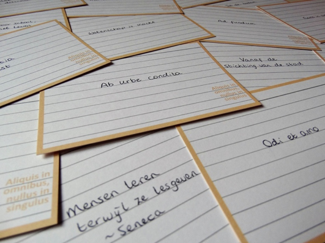

# Projectopdracht Spaced Flashcards

_Flashcards_ zijn kaartjes (virtueel of fysiek) met info op twee kanten, en worden gebruikt door mensen die dingen uit hun hoofd willen leren: Een stapel kaartjes (een ‘deck’) kan bijvoorbeeld op de ene kant een Nederlands woord hebben staan, en op de andere kant staat dan dat woord in het Frans. Door steeds een kaartje op te pakken, en te kijken of je weet wat er op de achterkant staat, kun je oefenen door jezelf te overhoren. 
_Spaced repetition_ is een zelfstudie-techniek die veel gecombineerd wordt met flashcards. Cognitief psychologen hebben wetenschappelijk laten zien dat informatie die je leert op een voorspelbare manier weer langzaam vergeten wordt als de info niet hergebruikt wordt. Dat het tempo van vergeten neemt af naarmate je de info vaker geoefend hebt. Op basis van die theorie kan een computerprogramma bepalen wat de ideale tijdsduur is tussen twee oefensessies, en door gedisciplineerd te oefenen op de momenten die het programma bepaald heeft, kun je met vrij weinig inspanning toch veel info in korte tijd leren.
Er zijn vrij veel apps voor het werken met flashcards. Die zijn soms duur, soms slecht, en soms duur én slecht (zoals Anki en Quizlet, twee van de populairste apps). We hebben geen app gevonden die gratis én goed is.

**Maak een webapplicatie waarin gebruikers ‘flashcards’ kunnen maken en, met spaced repetition, zichzelf kunnen overhoren daarin. De app moet:**

- **heel gebruikersvriendelijk zijn;**
- **oefenen met flashcards comfortabel maken op een telefoon;**
- **geavanceerde flashcards ondersteunen: kaarten met meer dan twee virtuele ‘kanten’, kaarten met audio en afbeeldingen;** 
- **spaced repetition ondersteunen;**
- **import-export mogelijkheden hebben: Gebruikers moeten makkelijk grote flashcard-decks kunnen maken met externe tools en die importeren. Het zou extra cool zijn als decks van Anki en wellicht ook Quizlet geïmporteerd kunnen worden.**

Vervolgens zijn er nog een hoop extra’s te bedenken, zoals:

- variatie in oefenvormen;
- een ‘echte’ iOS en/of Android app;
- een off-line modus hebben, waarin je decks kunt downloaded die dan ook beschikbaar zijn als je geen internet hebt;
- multiplayer feature: tegelijk hetzelfde deck oefenen;
- decks uitwisselen met andere gebruikers (via de app zelf i.p.v. import/export)
- etc. (er is vast een hoop ~~te jatten~~ inspiratie op te doen bij bestaande apps)
